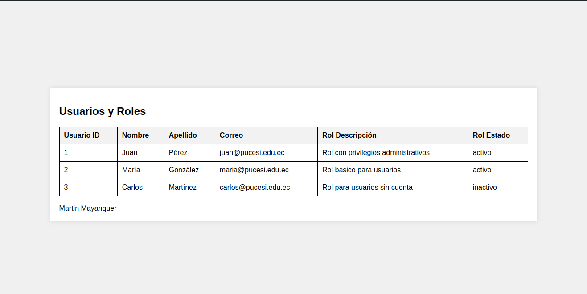

# Parcial 2

Antes de iniciar, este es el script de la base de datos, hecho en phpMyAdmin:

```sql

-- phpMyAdmin SQL Dump
-- version 5.2.1
-- https://www.phpmyadmin.net/
--
-- Servidor: localhost
-- Tiempo de generación: 30-06-2024 a las 10:13:56
-- Versión del servidor: 10.4.32-MariaDB
-- Versión de PHP: 8.1.25

SET SQL_MODE = "NO_AUTO_VALUE_ON_ZERO";
START TRANSACTION;
SET time_zone = "+00:00";


/*!40101 SET @OLD_CHARACTER_SET_CLIENT=@@CHARACTER_SET_CLIENT */;
/*!40101 SET @OLD_CHARACTER_SET_RESULTS=@@CHARACTER_SET_RESULTS */;
/*!40101 SET @OLD_COLLATION_CONNECTION=@@COLLATION_CONNECTION */;
/*!40101 SET NAMES utf8mb4 */;

--
-- Base de datos: `parcial2`
--

-- --------------------------------------------------------

--
-- Estructura de tabla para la tabla `tbl_roles`
--

CREATE TABLE `tbl_roles` (
  `rol_id` int(11) NOT NULL,
  `rol_nombre` varchar(50) DEFAULT NULL,
  `rol_descripcion` varchar(255) DEFAULT NULL,
  `rol_estado` enum('activo','inactivo') DEFAULT 'activo'
) ENGINE=InnoDB DEFAULT CHARSET=utf8mb4 COLLATE=utf8mb4_general_ci;

--
-- Volcado de datos para la tabla `tbl_roles`
--

INSERT INTO `tbl_roles` (`rol_id`, `rol_nombre`, `rol_descripcion`, `rol_estado`) VALUES
(1, 'Administrador', 'Rol con privilegios administrativos', 'activo'),
(2, 'Usuario', 'Rol básico para usuarios', 'activo'),
(3, 'Invitado', 'Rol para usuarios sin cuenta', 'inactivo');

-- --------------------------------------------------------

--
-- Estructura de tabla para la tabla `tbl_usuarios`
--

CREATE TABLE `tbl_usuarios` (
  `usu_id` int(11) NOT NULL,
  `usu_nombre` varchar(50) DEFAULT NULL,
  `usu_apellido` varchar(50) DEFAULT NULL,
  `usu_correo` varchar(100) DEFAULT NULL,
  `rol_id` int(11) DEFAULT NULL
) ENGINE=InnoDB DEFAULT CHARSET=utf8mb4 COLLATE=utf8mb4_general_ci;

--
-- Volcado de datos para la tabla `tbl_usuarios`
--

INSERT INTO `tbl_usuarios` (`usu_id`, `usu_nombre`, `usu_apellido`, `usu_correo`, `rol_id`) VALUES
(1, 'Juan', 'Pérez', 'juan@pucesi.edu.ec', 1),
(2, 'María', 'González', 'maria@pucesi.edu.ec', 2),
(3, 'Carlos', 'Martínez', 'carlos@pucesi.edu.ec', 3);

--
-- Índices para tablas volcadas
--

--
-- Indices de la tabla `tbl_roles`
--
ALTER TABLE `tbl_roles`
  ADD PRIMARY KEY (`rol_id`);

--
-- Indices de la tabla `tbl_usuarios`
--
ALTER TABLE `tbl_usuarios`
  ADD PRIMARY KEY (`usu_id`);

--
-- AUTO_INCREMENT de las tablas volcadas
--

--
-- AUTO_INCREMENT de la tabla `tbl_roles`
--
ALTER TABLE `tbl_roles`
  MODIFY `rol_id` int(11) NOT NULL AUTO_INCREMENT, AUTO_INCREMENT=4;

--
-- AUTO_INCREMENT de la tabla `tbl_usuarios`
--
ALTER TABLE `tbl_usuarios`
  MODIFY `usu_id` int(11) NOT NULL AUTO_INCREMENT, AUTO_INCREMENT=4;
COMMIT;

/*!40101 SET CHARACTER_SET_CLIENT=@OLD_CHARACTER_SET_CLIENT */;
/*!40101 SET CHARACTER_SET_RESULTS=@OLD_CHARACTER_SET_RESULTS */;
/*!40101 SET COLLATION_CONNECTION=@OLD_COLLATION_CONNECTION */;

```
## Modificar;

- app/Config/Database.php

```php
'hostname'     => 'localhost',
'username'     => 'root',
'password'     => '',
'database'     => 'parcial2',
'DBDriver'     => 'MySQLi',
```


## Para ver el contenido obtenido desde la base de datos, accede a:

http://localhost/parcial2/

<details>
  <summary>Imagen de la página de contenido obtenido desde la base de datos</summary>
  
</details>
