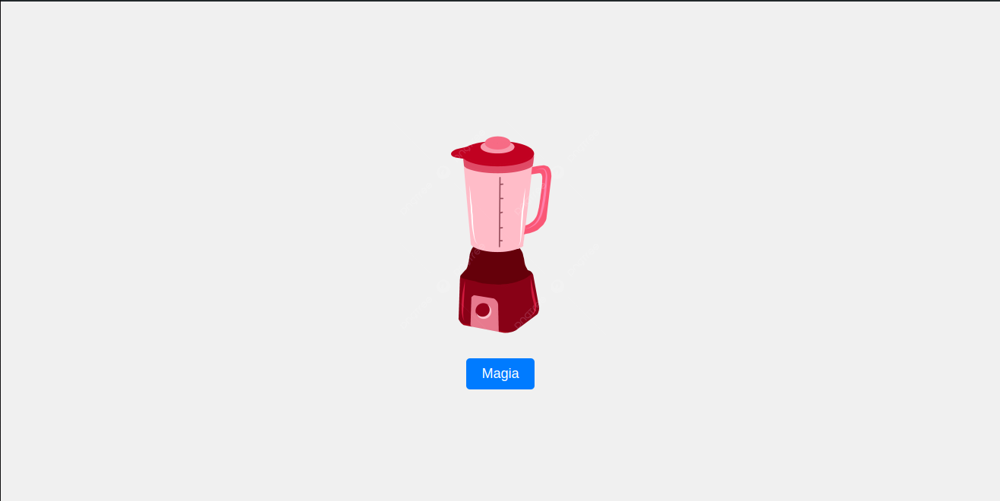
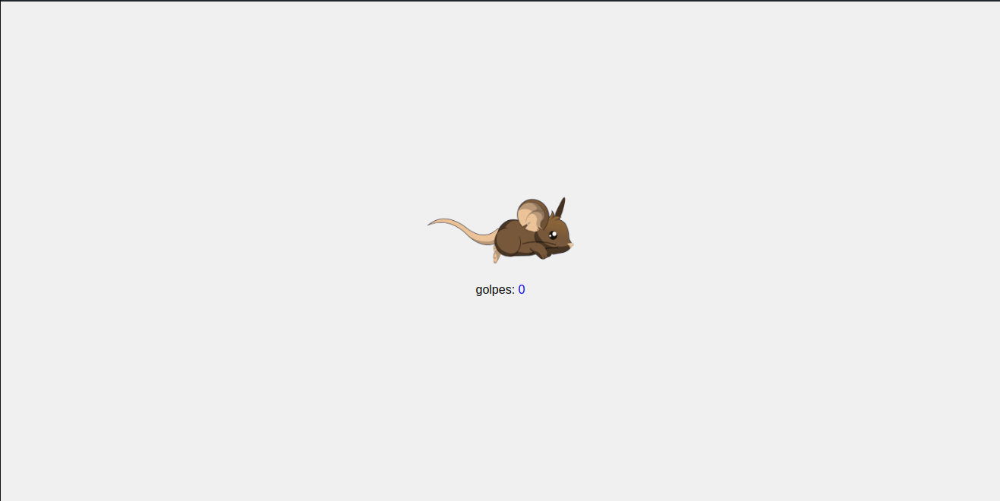

# Inicios de Codeigniter

**Autor:** Martin Mayanquer

Para acceder a las hojas, poner en la URL lo siguiente:

## Hoja 1
[http://localhost/semana7/ejercicio1](http://localhost/semana7/ejercicio1)

  
Imagen marcada como spoiler de hoja1

  

## Hoja 2
[http://localhost/semana7/ejercicio2](http://localhost/semana7/ejercicio2)

  
Imagen marcada como spoiler de hoja2

  

## Hoja 3
[http://localhost/semana7/ejercicio3](http://localhost/semana7/ejercicio3)

  
Imagen marcada como spoiler de hoja3

  

## Hoja 4
[http://localhost/semana7/ejercicio4](http://localhost/semana7/ejercicio4)

  
Imagen marcada como spoiler de hoja4

  

