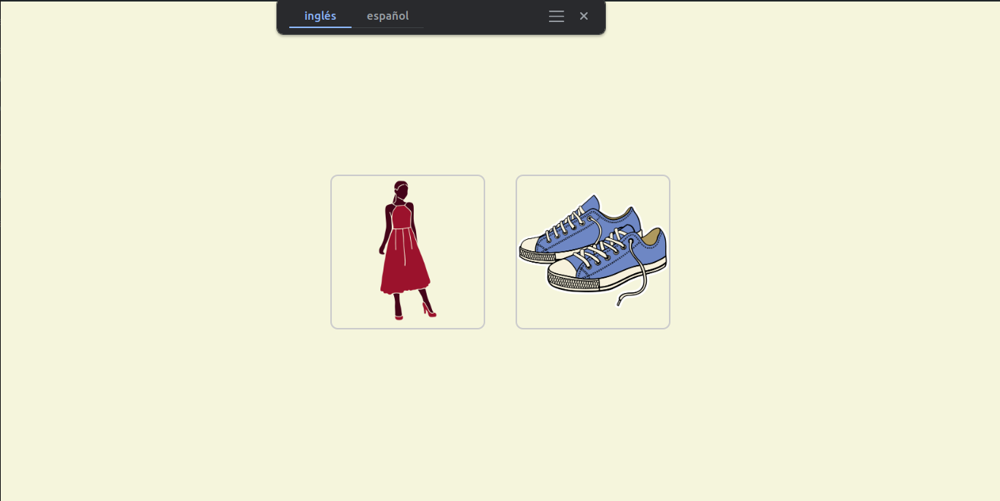
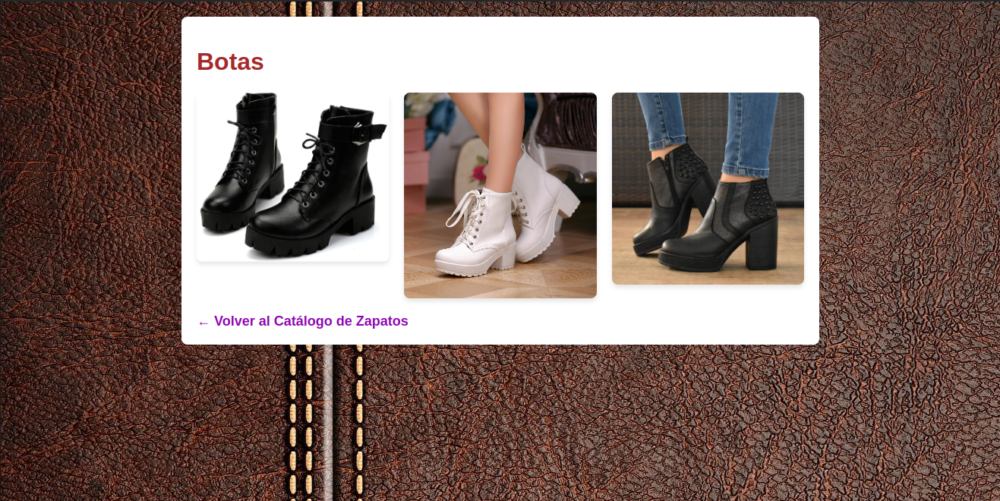
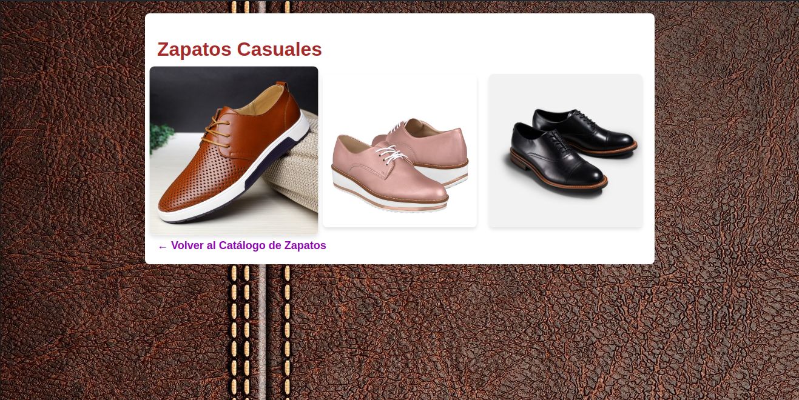
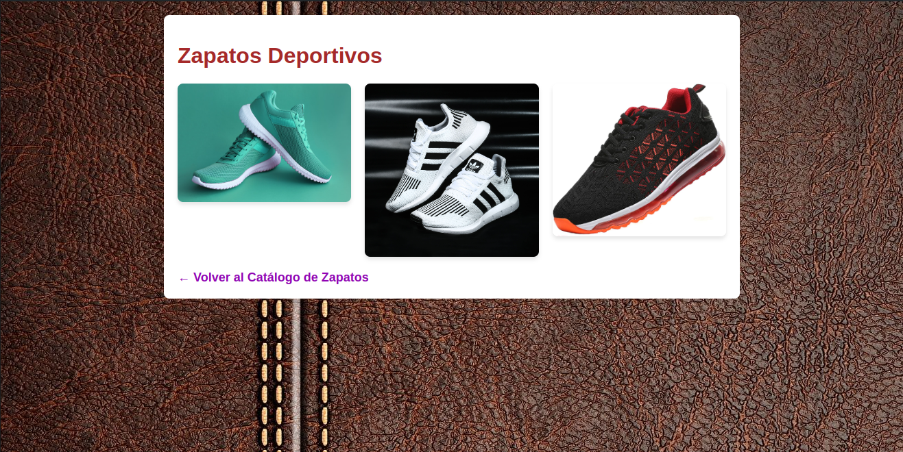
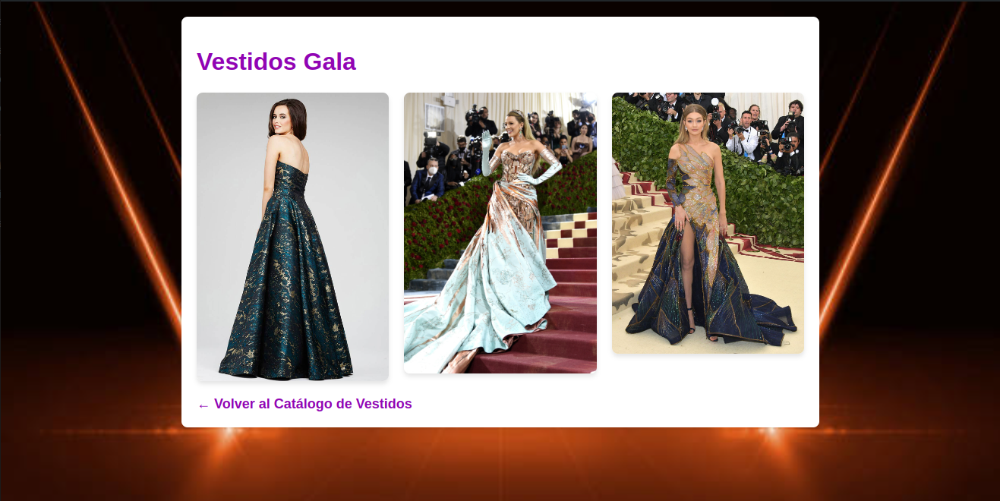
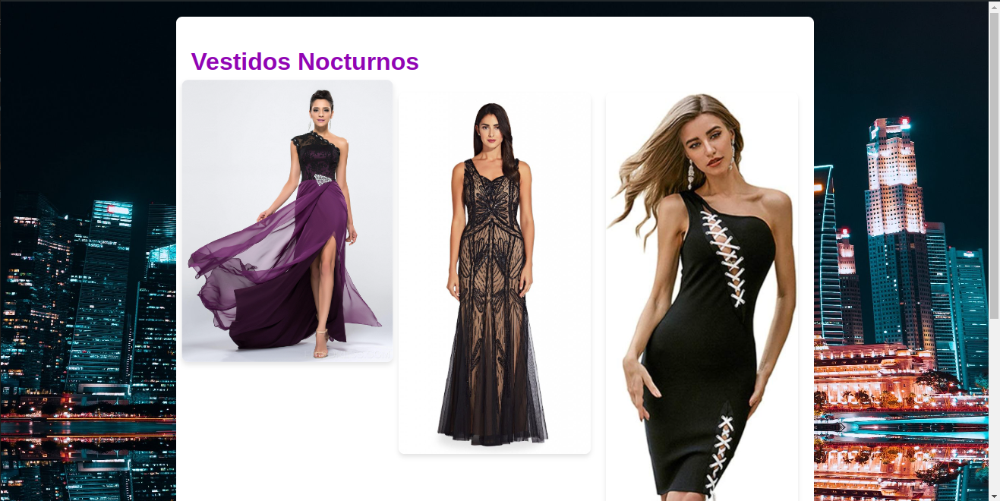
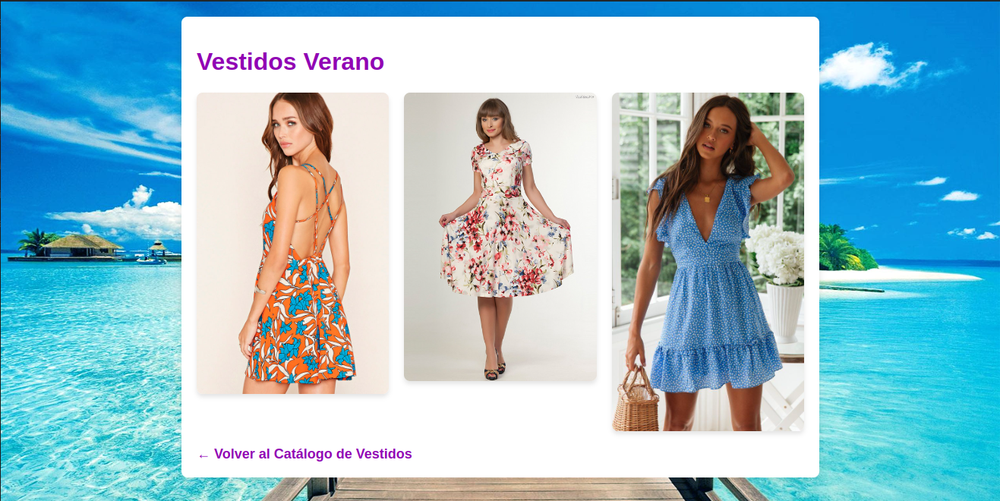

# Manejo de Rutas

**Autor:** Martin Mayanquer

Para acceder a la vista de catálogo, la URL debe estar así:

## Catálogo General
[http://localhost/semana8/catalogo](http://localhost/semana8/catalogo)

- /catalogo

  
Imagen del catalogo ropa

  

## Catálogo de Zapatos
[http://localhost/semana8/zapatos](http://localhost/semana8/zapatos)

### Categorías de Zapatos

- /zapatos/botas

  
Imagen de la categoría botas

  

- /zapatos/casuales

  
Imagen de la categoría casuales

  

- /zapatos/deportivos

  
Imagen de la categoría deportivos

  

## Catálogo de Vestidos
[http://localhost/semana8/vestidos](http://localhost/semana8/vestidos)

### Categorías de Vestidos

- /vestidos/gala

  
Imagen de la categoría gala

  

- /vestidos/nocturnos

  
Imagen de la categoría nocturnos

  

- /vestidos/verano

  
Imagen de la categoría verano

  

